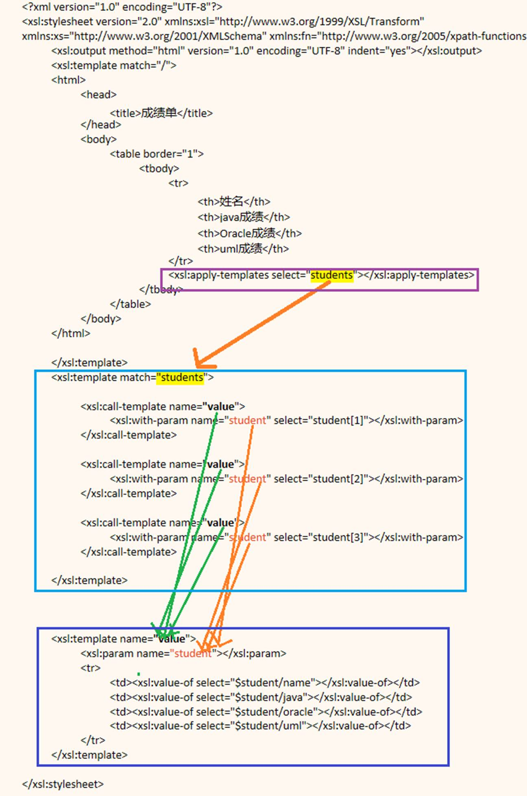

## 模板及应用

XSLT将xml看做一个文档，用树状结构。XSLT处理器从XML文档树中查找指定的节点（元素），找到后，再从XSLT文档中找到匹配该节点的模板，按模板内指定的样式显示数据。

一个XSLT至少含有一个根模板，XSLT处理器总是从根模板开始实施XSL转换。

```xml
<?xml version="1.0" encoding="UTF-8"?>

<students>

    <student id="1">
        <name>李白</name>
        <java>100</java>
        <oracle>99</oracle>
        <uml>98</uml>
    </student>

    <student id="1">
        <name>汪伦</name>
        <java>100</java>
        <oracle>100</oracle>
        <uml>100</uml>
    </student>

    <student id="1">
        <name>杜甫</name>
        <java>100</java>
        <oracle>79</oracle>
        <uml>88</uml>
    </student>

</students>
```

### 1.模板规则（Template Rule）

必须包含match属性，指明该模板可以匹配那些xml节点。

#### （1）定义模板

```xml
<xsl:templavte match="XPath" mode="唯一">

…规则

</xsl:template>
```

 mode=“”其中mode的值唯一，对同一个节点定义多个规则，多种情况使用。

#### （2）调用模板

```xml
<xsl:apply-templates select="XPath"]  [mode="唯一"]/>
```

select：用于指定那些标记需要调用另一个模板来处理。可选属性，被省略，则按照当前节点集顺序处理**每个节点**。

 xml中使用

```xml
<?xml-stylesheet type="text/xsl" href="TemplateRule.xslt"?>
```

```xml
<?xml version="1.0" encoding="UTF-8"?>
<xsl:stylesheet version="2.0" xmlns:xsl="http://www.w3.org/1999/XSL/Transform" xmlns:xs="http://www.w3.org/2001/XMLSchema" xmlns:fn="http://www.w3.org/2005/xpath-functions">
    <xsl:output method="html"  encoding="gb2312"/>
    <xsl:template match="/">

        <html>
            <head>
                <title>成绩单</title>
            </head>
            <body>
                <table border="1">
                    <tbody>
                        <tr>
                            <th>姓名</th>
                            <th>java成绩</th>
                            <th>oracle成绩</th>
                            <th>uml成绩</th>
                        </tr>
                        <xsl:apply-templates select="students"/>
                    </tbody>
                </table>
            </body>
        </html>
    </xsl:template>

    <!--模板规则-->

    <xsl:template match="students"> 模板规则有xpath
        <td><xsl:value-of select="student[1]/name" /></td>
        <td><xsl:value-of select="student[1]/java" /></td>
        <td><xsl:value-of select="student[1]/oracle" /></td>
        <td><xsl:value-of select="student[1]/uml" /></td>
    </xsl:template>
</xsl:stylesheet>
```

### 2.具名模板（Named Template）

#### （1）模板定义

```xml
<xsl:template name="">

…规则

</xsl:template>
```

定义时无select

#### （2）模板调用

```xml
<xsl:call-template name=""/>    
```

具名模板**不具有上下文节点**，向模板传递参数。需要在call-template中使用with-param元素

#### （3）传递参数

```xml
<xsl:with-param name="stu" select=""/>
```

#### （4）参数

```xml
<xsl:param name="stu"/>
```

参数在模板内声明是局部参数，在顶层元素则是全局参数

**Named Template** 指的是有具体名称的模板，可以被**call-template**元素反复调用。必须有name属性。

```xml
<?xml version="1.0" encoding="UTF-8"?>
<xsl:stylesheet version="2.0" xmlns:xsl="http://www.w3.org/1999/XSL/Transform" xmlns:xs="http://www.w3.org/2001/XMLSchema" xmlns:fn="http://www.w3.org/2005/xpath-functions">
    <xsl:output method="html"  encoding="gb2312"/>
    <xsl:template match="/">
        <html>
            <head>
                <title>成绩单</title>
            </head>
            <body>
                <table border="1">
                    <tbody>
                        <tr>
                            <th>姓名</th>
                            <th>java成绩</th>
                            <th>oracle成绩</th>
                            <th>uml成绩</th>
                        </tr>
                        <xsl:apply-templates select="students"/>
                    </tbody>
                </table>
            </body>
        </html>
    </xsl:template>

  ①
    <xsl:template match="students">
        <xsl:call-template name="tname">②
            <xsl:with-param name="stu" select="student[1]"/> ③
        </xsl:call-template>

        <xsl:call-template name="tname">
            <xsl:with-param name="stu" select="student[2]"/>
        </xsl:call-template>

    </xsl:template>


    <xsl:template name="tname">②
        <xsl:param name="stu"/><!--定义，声明参数。本例子主要声明-->③
        <tr>
            <td><xsl:value-of select="$stu/name" /></td>  <!--需要定义局部参数，不然报错-->
            <td><xsl:value-of select="$stu/java" /></td>
            <td><xsl:value-of select="$stu/oracle" /></td>
            <td><xsl:value-of select="$stu/uml" /></td>
        </tr>
    </xsl:template>

</xsl:stylesheet>
```

箭头为传参顺序



```xml
<xsl:param name="student"/>
```

用于定义一个参数

模板外：全局参数

模板内：局部参数

## 转换文档案例

### 1.转换html常用标记

（一）`<value-of>`

将**所有节点集**的内容输出出来。

（二）`<for-each>`

（三）`<if>`

（四）`<choose>`

（五）`<sort>`

一般放在`<for-each>`中

#### （1）模板规则

```xml
<?xml version="1.0" encoding="UTF-8"?>
<xsl:stylesheet version="2.0" xmlns:xsl="http://www.w3.org/1999/XSL/Transform" xmlns:xs="http://www.w3.org/2001/XMLSchema" xmlns:fn="http://www.w3.org/2005/xpath-functions">
    <xsl:param name="avg" select="round(avg(//java)+fn:avg(//oracle)+fn:avg(//avg(uml)))div 3"/>  
    <xsl:output method="html" encoding="GB2312" indent="yes" />
    <xsl:template match="/">
        <html>
            <head>
                <title>成绩单</title>
            </head>
            <body>
                <table border="1">
                    <tbody>
                        <tr>
                            <th>姓名</th>
                            <th>java成绩</th>
                            <th>oracle成绩</th>
                            <th>uml成绩</th>
                            <th>总成绩</th>
                            <th>排名</th>
                        </tr>
                        
                        <xsl:apply-templates />
                    </tbody>

                </table>
                总体平均分:<b><xsl:value-of select="$avg"></xsl:value-of></b>
                评估：
                <xsl:choose>
                    <xsl:when test="$avg >= 90"> 总体成绩优秀</xsl:when>
                    <xsl:when test="$avg >= 80"> 总体成绩良好！</xsl:when>
                    <xsl:when test="$avg >= 60"> 总体成绩及格，需要进步</xsl:when>
                    <xsl:otherwise>总体成绩不合格，需要寻找原因！</xsl:otherwise>
                </xsl:choose>
            </body>

        </html>

    </xsl:template>
    
    <xsl:template match="students">
        <xsl:for-each select="student">
            <xsl:sort select="sum(*[position()>1])" order="descending"/>
            <tr>
                <td><xsl:value-of select="name"/></td>        
                <td><xsl:value-of select="java"/></td>
                <td><xsl:value-of select="oracle"/></td>
                <td><xsl:value-of select="uml"/></td>
                <td><xsl:value-of select="fn:sum(.//*[fn:position()>1])"></xsl:value-of></td>
                <td><xsl:value-of  select="fn:position()"></xsl:value-of></td>
            </tr>
        </xsl:for-each>

        <tr>
            <th>平均分</th>
            <td><xsl:value-of select="round(avg(student/java))"/></td>
            <td><xsl:value-of select="round(avg(student/oracle))"/></td>
            <td><xsl:value-of select="round(avg(student/uml))"/></td>
            <td><xsl:value-of select="sum(.//student/*[fn:position()>1])"></xsl:value-of></td>
        </tr>
    </xsl:template>
</xsl:stylesheet>
```

| **姓名**   | java成绩 | **oracle**成绩 | **uml**成绩 | **总成绩** | **排名** |
| ---------- | -------- | -------------- | ----------- | ---------- | -------- |
| 汪伦       | 100      | 100            | 100         | 300        | 1        |
| 李白       | 100      | 99             | 98          | 297        | 2        |
| 杜甫       | 100      | 79             | 88          | 267        | 3        |
| **平均分** | 100      | 93             | 95          | 864        |          |

总体平均分:**96** 评估： 总体成绩优秀

#### （2）具名模板

```xml
<?xml version="1.0" encoding="UTF-8"?>
<xsl:stylesheet version="2.0" xmlns:xsl="http://www.w3.org/1999/XSL/Transform" xmlns:xs="http://www.w3.org/2001/XMLSchema" xmlns:fn="http://www.w3.org/2005/xpath-functions">
    <xsl:param name="avg" select="round(avg(//java)+fn:avg(//oracle)+fn:avg(//avg(uml)))div 3"/>  
    <xsl:output method="html" encoding="GB2312" indent="yes"/>
    <xsl:template match="/">
        <html>
            <head>
                <title>成绩单</title>
            </head>
            <body>
                <table border="1">
                    <tbody>
                        <tr>
                            <th>姓名</th>
                            <th>java成绩</th>
                            <th>oracle成绩</th>
                            <th>uml成绩</th>
                            <th>总成绩</th>
                            <th>排名</th>
                        </tr>

                        <xsl:apply-templates />

                    </tbody>
                </table>

                总体平均分:<b><xsl:value-of select="$avg"></xsl:value-of></b>
                评估：
                <xsl:choose>
                    <xsl:when test="$avg >= 90"> 总体成绩优秀</xsl:when>
                    <xsl:when test="$avg >= 80"> 总体成绩良好！</xsl:when>
                    <xsl:when test="$avg >= 60"> 总体成绩及格，需要进步</xsl:when>
                    <xsl:otherwise>总体成绩不合格，需要寻找原因！</xsl:otherwise>
                </xsl:choose>
            </body>
        </html>
    </xsl:template>
    <xsl:template match="students">

        <xsl:for-each select="student">
            <xsl:sort select="sum(*[position()>1])" order="descending"/>
            <tr>
                <td>
                    <xsl:value-of select="name"/>
                </td>
                <td>
                    <xsl:call-template name="tname">
                     <xsl:with-param name="pname" select="java"/>   
                    </xsl:call-template>
                </td>

                <td>
                    <xsl:call-template name="tname">
                     <xsl:with-param name="pname" select="oracle"/>
                    </xsl:call-template>
                </td>


                <td>
                    <xsl:call-template name="tname">
                     <xsl:with-param name="pname" select="uml"/>
                    </xsl:call-template>
                </td>

                <td>
                    <xsl:value-of select="fn:sum(.//*[fn:position()>1])"></xsl:value-of>
                </td>

                <td>
                    <xsl:value-of  select="fn:position()"></xsl:value-of>
                </td>
            </tr>
        </xsl:for-each>

        <tr>
            <th>平均分</th>
            <td><xsl:value-of select="round(avg(student/java))"/></td>
            <td><xsl:value-of select="round(avg(student/oracle))"/></td>
            <td><xsl:value-of select="round(avg(student/uml))"/></td>
            <td><xsl:value-of select="sum(.//student/*[fn:position()>1])"></xsl:value-of></td>
        </tr>

    </xsl:template>

    <xsl:template name="tname">
        <xsl:param name="pname"/>  
        <xsl:if test="$pname/text()&gt;60">
            <font color="green"><xsl:value-of select="$pname"></xsl:value-of></font>
        </xsl:if>

        <xsl:if test="$pname/text()&lt;60">
            <font color="red"><xsl:value-of select="$pname"></xsl:value-of></font>
        </xsl:if>
    </xsl:template>

</xsl:stylesheet>
```

​

| **姓名**   | **java**成绩 | **oracle**成绩 | **uml**成绩 | **总成绩** | **排名** |
| ---------- | ------------ | -------------- | ----------- | ---------- | -------- |
| 汪伦       | 100          | 100            | 100         | 300        | 1        |
| 李白       | 100          | 59             | 98          | 257        | 2        |
| 杜甫       | 59           | 79             | 88          | 226        | 3        |
| **平均分** | 86           | 79             | 95          | 783        |          |

总体平均分:**87** 评估： 总体成绩良好！

### 2.转换为异构xml常用标记

（一）`<element>`

（二）`<attribute>`

（三）`<variable>`

（四）`<attribute-set>`

（五）`<copy>`或`<copy-of>`

（六）`<comment>`

（七）`<process-instruction>`

七、XSLT的复用

（一）`<import>`

（二）`<include>`
