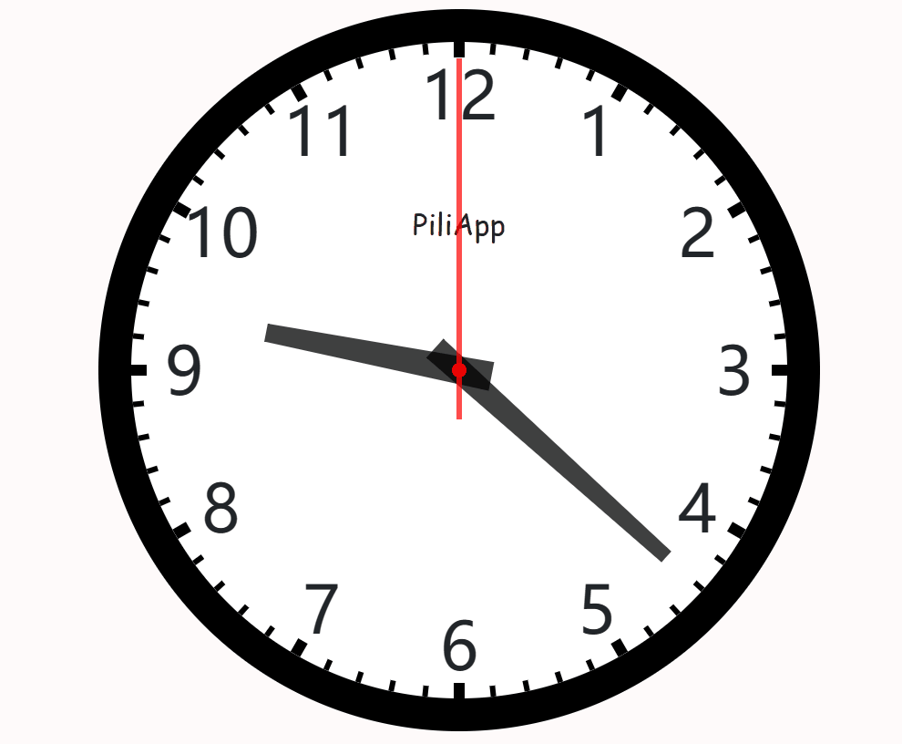

# 无用的记录

------

> 做你觉得正确的事情。🤣
>
> 听不到内心对你的抱怨。
>
> 多年以后的你能看得起现在的你。

> 我喜欢新鲜的事务！
>
> 我喜欢变化的事务！
>
> 为了新鲜我可以放弃稳定，为了变化，我可以承受痛苦。！

## 2022年5月21日

> 身可死但身不灭，有一个抗争的人生。:heart:
>
> 每天的成功是行为符合自己的思想。:muscle:
>
> 解决一个问题最好的办法就是不存在这个问题。

## 2022年10月27日

> 凡是通过捷径带来的快乐，一定会带来极大的痛苦。只有通过艰辛的努力，才会带来长久的快乐。

## 2022年10月31日

> 解决问题的最好办法就是没有此问题。

## 2022年11月14日

> 人具有有限的能量，不是万能的。所以需要尽可能利用可以利用的资源，节省自身的能量。
>
> 所有所做，均是因为喜欢。

## 2023年1月13日

> 生活太短太无聊，我需要挑战。
>
> 战胜每时每刻的**自己**。

## 2023年1月14日

> 不需要放弃，因为人生本来就很短；不需要犹豫，因为人生本来就很短；

## 2023年2月11日

> 很爽的东西，往往是瞬间快乐。
>
> 真实的快乐，一定是经过恒久的努力。
>
> 要足够独立。
>
> 大部分让人都在痛苦或绝境中！并不罕见。

## 2023年2月13日

> 每个瞬间都是新的开始。:new:

> 只有思想真正指导行为的时候，思想才会体现他的价值:fire:。行为开始的时候，才是改变开始的时候:new: 。

## 2023年2月13日

> 认识自己的有限性，时刻保持警惕:rotating_light:

> 自信-->坚强-->强硬:muscle:、善良:innocent: 、睿智:🧠 。&#x1F601;

## 2023年2月14日

> 全方位发展:a:

> 靠自己主动学习:man_student: 。

## 2023年2月14日

> 我的90%的痛苦来自于言行不一。:disappointed:

## 2023年2月22日

> 既然苦难总会来的，何不主动迎接，光鲜的经历。:happy:

> 至少你的心是朝着你想的方向。:heart:

## 2023年4月22日

> 每个人都会痛苦，区别有痛苦中是否继续前行。:footprints:

## 2023年9月19日

> 不管做什么，今天总会过去的。
>
> 所做一切都是为了取悦自己。:smile:
>
## 2023年9月8日

1.我们这个世界不缺完美的人，缺的是从内心发出的**真心、无畏、勇敢**和**正直**。

**2.专一** ：是目的

# 2023年12月21日

**主要目的：保证生活学习工作等事情在压力和焦虑可以继续进行。**

物理：

> 睡觉:sleeping:
> 生活规律:sun_with_face:
> 运动:walking:

精神：

> 宣泄:fire:`
> 沟通:family:

# 2023年12月30日

人总会吃苦的，区别与**主动**吃苦，还是**被动**吃苦。

产生好/坏影响最大的东西，就是最有力的东西。

# 2024年1月1日

**很重要，但是又不重要。**

# 2024年1月10日

乡镇中，由于人们的见识比较少，所以包容度较低。同时生活比较单调无趣。

相对丰富的生活过程。

人的想法，需要一个**持续**的事务   

来起到提醒作用。

# 2024年1月17日

**难受**也是一天，**舒服**也是一天，不如按照**自己的想法**过完这一天。人生的每一个时刻，过去了，就不会再有了。

# 2024年1月18日

**有用：**特定对象，对另一对象（一般作用人），产生足够的影响力。

对于一件事情是否能成功，其实，**我心中早有结果**。
