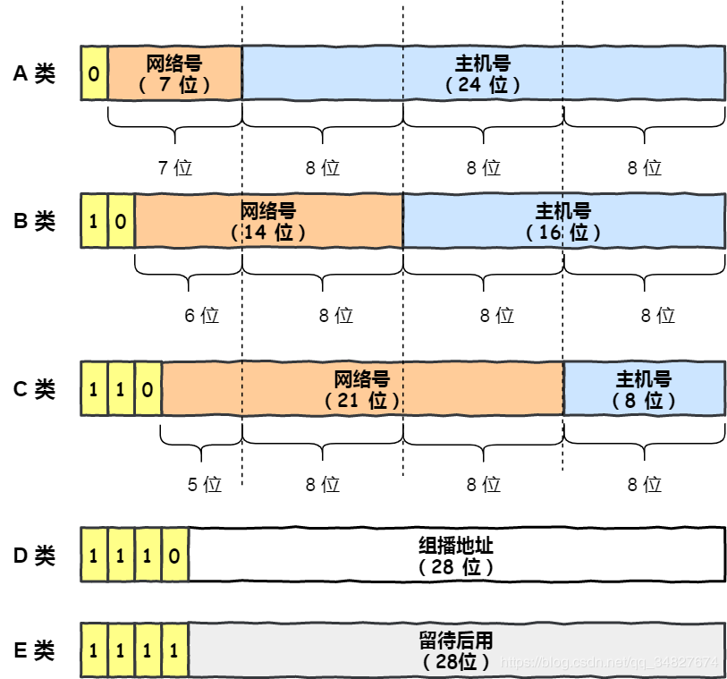

## IP地址格式

互联网上的每个接口必须有一个唯一的Internet地址（也称作IP地址）。目前广泛应用的IP编址方式是IP版本4（IPv4）。

```bash
IP地址::={<网络号>,<主机号>}
```

- 网络号：标志主机或路由器所连接的网络，整个互联网范围唯一。

- 主机号：标志该主机或该路由器，主机在他前面网络号范围内唯一。

**IPv4地址**：由32位二进制数组成，通常分为4个字节，每个字节用十进制数表示并用点号分隔，形成`点分十进制`表示法。

- 例如：192.168.1.1

**IPv6地址**：由128位二进制数组成，通常分为8组，每组16位，用十六进制数表示并用冒号分隔。

- 例如：2001:0db8:85a3:0000:0000:8a2e:0370:7334

## IP地址分类



:::tip 区分

- 区分各类地址的最简单方法是看它的第一个十进制整数，第一个数在1\~**127**范围的是A类地址；128\~**191**范围是B类地址；192\~**223**范围是C类地址。

- 一个网络指的是具有相同网络号net-id的主机的集合。用转发器或者网桥连接起来的若干个局域网仍然是一个网络。

:::

## ip地址指派范围


| IP地址类别 | 范围                        | 用途                                                       |
| ---------- | --------------------------- | ---------------------------------------------------------- |
| **A类**    | 0.0.0.0 - 127.255.255.255   | 适合大型网络，首位为0，后7位为网络号，24位为主机号         |
| **B类**    | 128.0.0.0 - 191.255.255.255 | 中型网络的首选，前两位为10，14位为网络号，16位为主机号     |
| **C类**    | 192.0.0.0 - 223.255.255.255 | 小型网络的理想选择，前三位为110，21位为网络号，8位为主机号 |
| **D类**    | 224.0.0.0 - 239.255.255.255 | 用于多播地址，前四位为1110，28位为组播组标识               |
| **E类**    | 240.0.0.0 - 255.255.255.255 | 保留用于实验和研究，前四位为1111，其余28位保留             |


:::warning

- 在实际网络配置中，还需要考虑私有IP地址范围（如10.x.x.x、172.16.x.x到172.31.x.x、192.168.x.x），这些地址在局域网内部使用，不会在互联网上路由。
- 子网掩码用于区分IP地址中的网络部分和主机部分，通过调整子网掩码的长度，可以灵活划分网络。
- IP地址的分配和管理由互联网名称与数字地址分配机构（ICANN）及其下属的区域互联网注册管理机构（RIRs）负责。

:::